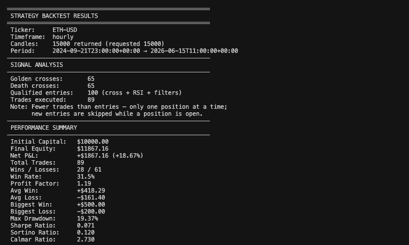
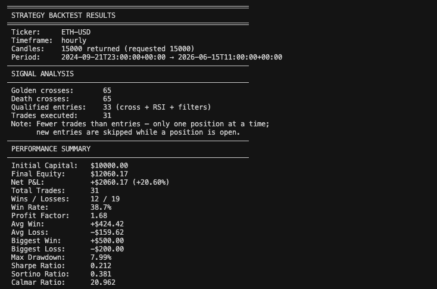

# strategy-enhancer

## How to Use

- Get your free API Key at (defitheodds.xyz)[https://defitheodds.xyz]
- Make a copy of example.env and call it .env
- Paste in your API Key
- copy strategies/base.js and create a new file eg. strategyA.js
- fill out the entry and exit criteria
- Run the backtest using `node index.js`

## Sample Output
Here is the output running the base strategy for ETH-USD over the last 15,000 hours

After enhancing with ONLY 1 DefiTheOdds prediction (expansion_probability)

